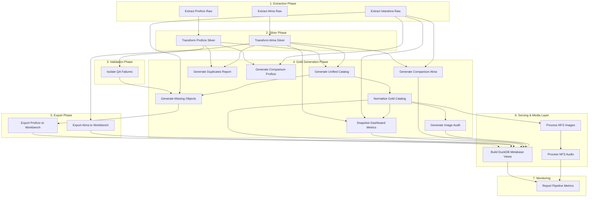

<div align="center">

  # 🐺 Wolfsonian Lakehouse ETL

  *An enterprise-grade, containerized Data Lakehouse architecture for extracting, staging, and incrementally merging museum and library collection data using Python, DuckDB, and Parquet.*

  [](#)
  [](#)
  [](#)
  [](#)
  [](#)
</div>

---

## 📖 Table of Contents
- [Quick Links](#-quick-links)
- [About the Project](#-about-the-project)
- [Architecture & Tech Stack](#-architecture--tech-stack)
- [Data Sources & Volumes](#-data-sources--volumes)
- [Key Features](#-key-features)
- [Project Structure](#-project-structure)

---

## 🔗 Quick Links
- **Lakehouse Catalog**: [lakehouse.wolfsonian.org](https://lakehouse.wolfsonian.org)
- **Metabase**: [metabase.wolfsonian.org](https://metabase.wolfsonian.org)

---

## 🧐 About the Project
The Wolfsonian Lakehouse is an automated, incremental ELT (Extract, Load, Transform) pipeline designed to unify disparate data sources into a single, high-performance analytics layer. It extracts data from APIs, legacy SQL Server databases, and binary MARC files, staging them as raw Parquet files before transforming them into a clean, "Gold" standard layer for downstream systems like Workbench and Metabase.

In addition to the data pipeline, the project features a powerful **Frontend Explorer**—a serverless, zero-latency web application built with Next.js and DuckDB WebAssembly. This custom interface directly queries the compressed Parquet data right inside the user's browser, allowing staff, researchers, and the public to visually search, filter, and curate collections across all 115,000+ unified library and museum records without the need for expensive database hosting or backend architecture.

## 🏗️ Architecture & Tech Stack
* **Orchestration:** Prefect 3 (Native 19-Node DAG), Docker Compose, and Make
* **Data Extraction:** Python 3.10 (Pandas, PyArrow, requests, pymarc) with strictly pinned dependencies for deterministic builds.
* **Database Connectivity:** SQLAlchemy, pyodbc (ODBC Driver 18 for SQL Server)
* **Authentication:** Automated Kerberos (`kinit`) integration inside containers
* **Storage Format:** Apache Parquet (High-speed, columnar, immutable storage)
* **Serving Layer:** DuckDB
* **Frontend Explorer:** Next.js, React, TailwindCSS, TypeScript
* **AI/LLM Integration:** Google Gemini API (`@google/generative-ai`) with DuckDB-driven Hybrid RAG
* **Data Pattern:** Medallion Architecture with Incremental Delta Merges (Upserts) and QA Quarantine.
* **Monitoring & Alerting:** Uptime Kuma for service health, custom Python Log Alerter for SMTP error notifications, and structured logging.

---

## 📊 Data Sources & Volumes

| Source | System | Records | Method |
|---|---|---|---|
| **Alma** | Ex Libris Library Management | 55,010 | Binary MARC (`.mrc`) file parsing via PyMARC |
| **Proficio** | Museum Collection Database | 60,938 | Kerberos-authenticated SQL Server via ODBC |
| **Islandora** | Public Digital Archive | 266,450 | Paginated REST API with concurrent fetching |
| **Unified Gold Catalog** | Merged output | 115,947 | Alma + Proficio aligned and concatenated |
| **Normalized Gold Catalog** | Analytics-ready output | 115,947 | Harmonized genres, dates, creators & titles |
| **Digital Images** | NFS Mounted Share | 299,347 | Parallel ingestion and JPEG compression |
| **Digital Audio** | NFS Mounted Share | 291 | MP3 caching and metadata mapping |

---

## ⚡ Key Features

* **Incremental Delta Merges (Upserts):** To avoid expensive full table scans, the Proficio extractor utilizes a high-watermark tracker to selectively pull only records created or modified since the last run. The Silver layer then seamlessly merges (upserts) these deltas into a persistent master Parquet table, deduplicating on `field_identifier` (the Proficio catalog number) without duplicating data.
* **Metabase Serving Layer (DuckDB):** The pipeline concludes by automatically generating a persistent DuckDB database with instantaneous, zero-copy Views pointing directly to the Parquet files. Metabase easily connects to this DuckDB file for lightning-fast BI visualization. If DuckDB is locked by an active Metabase session, the pipeline gracefully skips view recreation — Metabase automatically picks up the freshly updated Parquet files on the next query.
* **QA Quarantine (Dead Letter Queue):** Records that fail critical data quality checks (missing identifiers, empty titles) are automatically isolated into a `proficio_qa_failures.parquet` file via a dedicated microservice instead of breaking the pipeline. This allows data stewards to easily identify and fix dirty source data.
* **Concurrent API Fetching:** The Islandora microservice utilizes a `ThreadPoolExecutor` and auto-discovery logic to fetch paginated API data rapidly, utilizing exponential backoff for network resilience.
* **Unified Gold Catalog:** The pipeline dynamically bridges the massive schema gap between library systems (Alma) and museum systems (Proficio), automatically aligning and concatenating both into a single unified queryable table with a strict predetermined column hierarchy.
* **Gold Normalization Layer:** A dedicated post-merge harmonization step (`export_gold_normalized.py`) standardizes vocabulary across both source systems — normalizing genre labels (e.g., `POSTER` → `Poster`), stripping MARC trailing punctuation from titles, cleaning creator names, and deriving `year_created` and `decade_created` columns for time-series analytics. It also generates a consolidated `search_text` column that systematically normalizes diacritics and merges 12+ text fields into a single blob, enabling instantaneous, accent-agnostic global text search on the frontend.
* **Digital Gap Analysis:** The `missing_objects.parquet` output identifies which internal catalog records (Proficio museum objects) are absent from the public-facing Islandora digital archive (`digital.wolfsonian.org`), supporting prioritization of digitization and content migration efforts.
* **Parallel Image Ingestion & Conversion:** Ingests raw `.tif`/`.tiff` catalog images from the mounted NFS share, converts them to JPEG, and optimizes them for the frontend. Using a memory-efficient `ThreadPoolExecutor` with 32 parallel workers, it concurrently reads and encodes images on the fly while streaming only required metadata to avoid Out-Of-Memory (OOM) crashes on large datasets. It utilizes dual-layer in-memory caching to skip already processed images in O(1) time.
* **Automated Audio Ingestion:** Recursively scans the `Islandora_Audio` network drive to ingest, parse, and map `.mp3` and `.wav` audio files directly to unified catalog identifiers using high-performance, memory-optimized multi-threading.
* **Storage Protection & Web Resizing:** Converts large ~10MB+ TIFFs into highly compressed JPEGs restricted to a maximum of 1200px on the longest side and saved at quality 80. This reduces file size by ~20x-50x (down to ~200KB per image), allowing the full ~56k image catalog to fit in less than 13GB of local disk space while drastically accelerating webpage loading times.
* **Cross-System Deduplication:** Dynamically reconciles identifiers between Library (Alma) and Museum (Proficio) catalogs, natively handling Alma's semicolon-separated multi-accession numbers to prioritize Museum records. A reporting script automatically generates exact collision matches for manual staff review on every pipeline run.
* **Native Workflow Orchestration:** The pipeline execution is managed natively by Prefect. The core logic operates as a 19-node Directed Acyclic Graph (DAG) using direct function imports. This ensures stateful execution, robust exception handling, and highly granular task-level monitoring via the Prefect dashboard without relying on fragile sub-shells.
* **Automated Uptime & Error Alerting:** A dedicated Uptime Kuma container continuously tracks the health of all web and orchestration endpoints. Alongside this, a custom local Python microservice continuously tails the Docker logs, instantly dispatching SMTP email alerts to the team if any container throws a critical error or exception.

---

## 🔀 Pipeline DAG (Directed Acyclic Graph)

The entire Lakehouse architecture is fully orchestrated via Prefect. Here is the automated dependency graph that executes on every run:



## 🔍 The Frontend Explorer

The original purpose of the Lakehouse Frontend Explorer was to solve the institution's most critical data silo problem: bridging the gap between the library’s Alma system and the museum’s Proficio system. Instead of forcing researchers and staff to use two separate, slow, and outdated legacy platforms, the Explorer unifies all 115,000+ records into a single, lightning-fast public entry point. By leveraging serverless browser technology (DuckDB WebAssembly), it entirely bypasses the need for expensive third-party vendors and backend servers, delivering instantaneous search and visual discovery at zero ongoing computing cost.

### Explorer Features

**AI & Search Capabilities**
* **Hybrid RAG AI Assistant:** A persistent, context-aware Chatbot powered by Google's Gemini 2.5 Flash API. It leverages Retrieval-Augmented Generation (RAG) by dynamically querying the local DuckDB instance and injecting accurate catalog metadata directly into the system prompt before responding.
* **Context-Aware Hyperlinking:** The AI naturally integrates clickable Markdown links pointing straight to standalone, full-screen metadata records (`/record/[id]`), smoothly bridging the gap between natural language discovery and deep collection exploration.

**Architecture & Performance**
* **Serverless Zero-Latency Engine:** Uses DuckDB WebAssembly to download and query the compressed Parquet data directly inside the user's browser, resulting in instantaneous search results.
* **Unified Search:** Automatically searches across both museum objects and library materials simultaneously.
* **Cost-Free Scaling:** Because the browser does all the computational work, the application can scale to thousands of simultaneous users without increasing cloud hosting costs.

**Discovery & Navigation**
* **Direct Standalone Routing:** We recently executed a sweeping architectural refactor to standardize the application's UX and navigation flow. We completely eliminated legacy modal-based overlay systems across all six search grids, replacing it with a clean, direct routing architecture utilizing standard Next.js navigation. Users now seamlessly navigate directly to dedicated, shareable standalone record pages to view the 50/50 metadata split, resulting in a leaner, faster application.
* **Interactive Historical Timeline:** Allows users to dynamically slide and filter the entire catalog by decade or specific years in real-time.
* **Algorithmic Discovery Engine:** A randomized visual discovery tool that serves users a highly curated subset of the collection to encourage organic exploration.
* **Semantic Discovery:** When viewing a record, the engine instantly queries DuckDB for 4 randomized, related records that share the same Subject, Genre, or Creator, encouraging users to discover related content.
* **Dynamic Creator & Subject Dossiers:** Automatically generates dedicated landing pages that aggregate and display all cataloged works by a specific artist, designer, author, or subject. Clickable hyperlinks are integrated across the search grid and standalone record pages for seamless navigation.
* **Clean Metadata Records:** Dedicated standalone pages automatically map internal database fields to user-friendly labels (e.g., Accession Number) and hide redundant system data to provide a pristine viewing experience.
* **Infinite Scroll Grid:** A high-performance masonry grid that can render thousands of images smoothly without pagination limits.
* **Advanced Search Facets:** Easily filter by specific objects (Has Images toggle, Genre categories, etc.) directly from the top interface.
* **Interactive Image Reader:** A sleek, minimalist single-image viewer for multi-image records (like multi-page books or varied 3D views). It features keyboard navigation, Next/Prev controls, and a dynamic thumbnail strip that replaces endless scrolling with a focused reading experience. It includes an interactive full-screen lightbox toggle, allowing the entire component—complete with thumbnails and controls—to fluidly expand for an immersive viewing experience.
* **Integrated Audio Player:** A custom audio player embedded into record pages featuring automatic multi-track discovery and synchronized track selectors for seamless playback of digitized historical recordings.
* **Smart Fallback Identifiers:** Seamlessly handles untitled items by safely falling back to their Accession Number, ensuring every record remains identifiable.

**Staff & Researcher Tools**
* **Browser-Native Staff Collections:** Staff can curate custom lists of catalog records directly within their browser memory (`localStorage`), allowing them to build research sets without ever needing to log in or create an account. It features advanced BigInt serialization to safely handle DuckDB WASM's 64-bit integer properties natively within the browser caching system.
* **Shareable Collection Links:** Users can instantly generate a custom serverless URL containing their curated item IDs, allowing them to share curated galleries with colleagues with zero backend architecture. 
* **CSV Export Engine:** With a single click, users can instantly export their curated collections into a formatted spreadsheet. The export natively injects `=IMAGE("url")` formulas to instantly render high-res thumbnail previews directly inside Google Sheets and Excel cells alongside the metadata.
* **One-Click Image Downloads:** High-visibility download buttons integrated directly into the image reader, allowing staff to quickly save web-optimized JPEGs for their work.
* **Digitization Requests:** Context-aware action buttons that allow researchers to formally request digitization workflows for archival objects that currently lack photography.
* **Print-on-Demand Merch Integration:** Context-aware action buttons on eligible records (such as posters and flat artworks) dynamically route users to a custom merchandise view (`/merch/[identifier]`). This allows users to seamlessly order custom prints, apparel, and souvenirs of public-domain museum artifacts directly via an automated print-on-demand fulfillment pipeline.

---

## 📂 Project Structure

```text
wolf-lakehouse/
├── data/                        # The Lakehouse Storage Volume
│   ├── export/
│   │   └── workbench_upload.csv
│   ├── gold/                    # Gold Layer: Clean outputs & QA failures
│   │   ├── alma_workbench_export.csv
│   │   ├── comparison_proficio.parquet
│   │   ├── duplicates_report_YYYYMMDD_HHMMSS.csv
│   │   ├── images/              # Local storage for web-optimized JPEGs
│   │   ├── missing_objects.parquet
│   │   ├── proficio_qa_failures.parquet
│   │   ├── snapshots/           # Historical time-series dashboard metrics
│   │   ├── unified_catalog_normalized.parquet  # Harmonized analytics view
│   │   └── unified_catalog.parquet
│   ├── metabase.db.mv.db        # Metabase persistence DB
│   ├── metabase.db.trace.db     # Metabase persistence DB trace
│   ├── metrics.json             # Execution metrics for Prefect dashboard
│   ├── raw/                     # Bronze Layer: Unaltered source dumps
│   │   ├── alma/
│   │   │   ├── alma_raw_dump.parquet
│   │   │   ├── BIBLIOGRAPHIC_16308238980006571_16308238960006571_1.mrc
│   │   │   ├── BIBLIOGRAPHIC_16429188970006571_16429188950006571_1.mrc
│   │   │   ├── BIBLIOGRAPHIC_16464220520006571_16429186080006571_1.mrc
│   │   │   └── BIBLIOGRAPHIC_16501241860006571_16429186080006571_1.mrc
│   │   ├── digital_images/
│   │   ├── islandora/
│   │   │   └── islandora_lookup.parquet
│   │   └── proficio/
│   │       └── incremental/     # Timestamped delta Parquet files
│   ├── silver/                  # Silver Layer: Persistent, deduplicated tables
│   │   ├── alma_silver.parquet
│   │   └── proficio_silver.parquet
│   ├── transform.log            # Execution logs
│   ├── watermark_proficio.json  # State tracker for Incremental Delta loads
│   └── wolfsonian_lakehouse.duckdb # Serving Layer Database for Metabase
├── docker-compose.yml           # The Master Switch for orchestration
├── Dockerfile                   # Builds the Python 3.10 environment + ODBC/Kerberos
├── Dockerfile.metabase          # Custom Ubuntu image for Metabase DuckDB support
├── Makefile                     # Standardized execution entrypoint commands
├── etl-pipelines/               # Core Extraction & Transformation Microservices
│   ├── add_has_image_col.py
│   ├── build_duckdb_views.py
│   ├── export_alma_to_workbench.py
│   ├── export_comparison_alma.py    # Generates Alma vs Islandora report
│   ├── export_comparison_proficio.py
│   ├── export_duplicates_report.py  # Generates overlap report between catalogs
│   ├── export_gold_missing_objects.py
│   ├── export_image_audit_report.py # Generates image completeness matrix
│   ├── export_gold_normalized_draft.py
│   ├── export_gold_normalized.py    # Cross-system harmonization
│   ├── export_gold_unified_catalog.py
│   ├── export_proficio_to_workbench.py
│   ├── extract_alma_raw.py
│   ├── extract_islandora_raw.py
│   ├── extract_proficio_raw.py
│   ├── isolate_proficio_qa_failures.py
│   ├── orchestrate_prefect.py   # Master Prefect Workflow
│   ├── process_images.py        # Parallel NFS image ingestion & conversion
│   ├── requirements.txt         # Strictly pinned dependencies
│   ├── snapshot_dashboard_metrics.py # Automated time-series tracking
│   ├── transform_alma_raw.py
│   ├── transform_alma_silver.py
│   └── transform_proficio_silver.py
├── frontend-explorer/           # Next.js web application for data exploration
│   ├── src/                     # Source code (Next.js App router, components, hooks)
│   ├── public/                  # Static icons and assets
│   ├── package.json             # NPM dependencies & build scripts
│   ├── postcss.config.mjs       # PostCSS config
│   └── next.config.ts           # Next.js build configuration
├── logs/                        # Server log outputs
├── metabase-plugins/            # Custom jar files for Metabase compatibility
│   └── duckdb.metabase-driver.jar
└── README.md                    # Project Documentation
```

---

## ✍️ Author
**Andrius Aukstuolis**  
*Lead Data Engineer*
