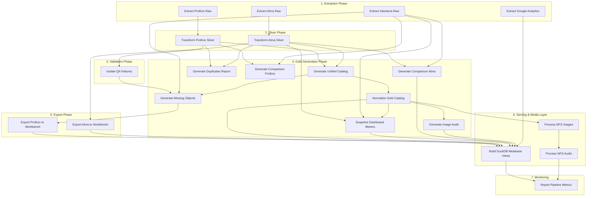

<div align="center">

  # 🐺 Wolfsonian Lakehouse ETL

  *An enterprise-grade, containerized Data Lakehouse architecture for extracting, staging, and incrementally merging museum and library collection data using Python, DuckDB, and Parquet.*

  [](#)
  [](#)
  [](#)
  [](#)
  [](#)
</div>

---

## 📖 Table of Contents
- [Quick Links](#-quick-links)
- [About the Project](#-about-the-project)
- [Architecture & Tech Stack](#-architecture--tech-stack)
- [Data Sources & Volumes](#-data-sources--volumes)
- [Key Features](#-key-features)
- [Project Structure](#-project-structure)

---

## 🔗 Quick Links
- **Lakehouse Catalog**: [lakehouse.wolfsonian.org](https://lakehouse.wolfsonian.org)
- **Lakehouse API Lookup Tool**: [labs.wolfsonian.org](https://labs.wolfsonian.org)
- **Metabase**: [metabase.wolfsonian.org](https://metabase.wolfsonian.org)

---

## 🧐 About the Project
The Wolfsonian Lakehouse is an automated, incremental ELT (Extract, Load, Transform) pipeline designed to unify disparate data sources into a single, high-performance analytics layer. It extracts data from APIs, legacy SQL Server databases, and binary MARC files, staging them as raw Parquet files before transforming them into a clean, "Gold" standard layer for downstream systems like Workbench and Metabase.

In addition to the data pipeline, the project features a powerful **Frontend Explorer**—a serverless, zero-latency web application built with Next.js and DuckDB WebAssembly. This custom interface directly queries the compressed Parquet data right inside the user's browser, allowing staff, researchers, and the public to visually search, filter, and curate collections across all 116,000+ unified library and museum records without the need for expensive database hosting or backend architecture.

## 🎮 Featured Digital Experiences
Built on top of the Lakehouse's high-performance DuckDB WASM engine, the Frontend Explorer features interactive mini-games and curation tools designed to engage users with the archive in novel ways:

- 🕵️‍♂️ **Curator's Challenge (Spot the Real Title):** A fast-paced, 10-round multiple-choice game where users must identify the real artifact title from a list of dynamically generated, highly-plausible fake titles pulled from the database.
- 🎨 **Art Swipe Discovery Mode:** A highly engaging, Tinder-style serendipity engine that utilizes DuckDB's `USING SAMPLE` function to serve a blazing-fast, randomized deck of visual artifacts. Users can casually swipe right and securely batch-save the entire curated deck to their personal collection simultaneously.
- 🧠 **Memory Match (Kreisman Collection):** A classic concentration card game that dynamically generates matching pairs using high-resolution architectural artifacts from the Kreisman collection, testing users' spatial memory.
- 🕸️ **Museum Connections:** A highly interactive, physics-based network visualization built with `react-force-graph-2d`. Users can click on artifacts to instantly query DuckDB and spawn dynamic webs of related creators and objects in real-time, mapping the hidden relationships within the archive.

## 🏗️ Architecture & Tech Stack
* **Orchestration:** Prefect 3 (Native 21-Node DAG), Docker Compose, and Make
* **Data Extraction:** Python 3.10 (Pandas, PyArrow, requests, pymarc) with strictly pinned dependencies for deterministic builds.
* **Database Connectivity:** SQLAlchemy, pyodbc (ODBC Driver 18 for SQL Server)
* **Authentication:** Automated Kerberos (`kinit`) integration inside containers
* **Storage Format:** Apache Parquet (High-speed, columnar, immutable storage)
* **Serving Layer:** DuckDB
* **Frontend Explorer:** Next.js, React, TailwindCSS, TypeScript
* **AI/LLM Integration:** Google Gemini API (`@google/generative-ai`) with DuckDB-driven Hybrid RAG
* **Data Pattern:** Medallion Architecture with Incremental Delta Merges (Upserts) and QA Quarantine.
* **Monitoring & Alerting:** Uptime Kuma for service health, custom Python Log Alerter for SMTP error notifications, structured logging, and automated Google Analytics ingestion for frontend traffic monitoring.

---

## 📊 Data Sources & Volumes

| Source | System | Records | Method |
|---|---|---|---|
| **Alma** | Ex Libris Library Management | 55,035 | Binary MARC (`.mrc`) parsing via PyMARC & Physical Item (`.csv`) mapping |
| **Proficio** | Museum Collection Database | 61,015 | Kerberos-authenticated SQL Server via ODBC |
| **Islandora** | Public Digital Archive | 267,007 | Paginated REST API with concurrent fetching |
| **Unified Gold Catalog** | Merged output | 116,050 | Alma + Proficio aligned and concatenated |
| **Normalized Gold Catalog** | Analytics-ready output | 116,050 | Harmonized genres, dates, creators & titles |
| **Digital Images** | NFS Mounted Share | 335,070 | Parallel ingestion and JPEG compression |
| **Digital Audio** | NFS Mounted Share | 26 | MP3 caching and metadata mapping |
| **Google Analytics** | GA4 Data API | Dynamic | Automated extraction of website traffic metrics |

---

## ⚡ Key Features

* **Standalone FastAPI Microservice:** A dedicated Dockerized REST API (`api-server`) built with FastAPI that natively serves data from the `unified_catalog_normalized.parquet` directly to external systems. It includes full CORS configuration and is reverse-proxied securely through the Next.js frontend, enabling third-party applications to query the Lakehouse with zero latency.
* **Incremental Delta Merges (Upserts):** To avoid expensive full table scans, the Proficio extractor utilizes a high-watermark tracker to selectively pull only records created or modified since the last run. The Silver layer then seamlessly merges (upserts) these deltas into a persistent master Parquet table, deduplicating on `field_identifier` (the Proficio catalog number) without duplicating data.
* **Metabase Serving Layer & Analytics (DuckDB):** The pipeline automatically generates a persistent DuckDB database powering an extensive suite of 18 separate SQL charts across 3 distinct dashboards (Lakehouse Analytics, Historical Metrics, and Image Completeness). Metabase easily connects to this DuckDB file for lightning-fast, zero-copy BI visualization, automatically picking up freshly updated Parquet files on every query.
* **QA Quarantine (Dead Letter Queue):** Records that fail critical data quality checks (missing identifiers, empty titles) are automatically isolated into a `proficio_qa_failures.parquet` file via a dedicated microservice instead of breaking the pipeline. This allows data stewards to easily identify and fix dirty source data.
* **Concurrent API Fetching:** The Islandora microservice utilizes a `ThreadPoolExecutor` and auto-discovery logic to fetch paginated API data rapidly, utilizing exponential backoff for network resilience.
* **Unified Gold Catalog:** The pipeline dynamically bridges the massive schema gap between library systems (Alma) and museum systems (Proficio), automatically aligning and concatenating both into a single unified queryable table with a strict predetermined column hierarchy.
* **Gold Normalization Layer:** A dedicated post-merge harmonization step (`export_gold_normalized.py`) standardizes vocabulary across both source systems — normalizing genre labels (e.g., `POSTER` → `Poster`), stripping MARC trailing punctuation from titles, cleaning creator names, and deriving `year_created` and `decade_created` columns for time-series analytics. It also generates a consolidated `search_text` column that systematically normalizes diacritics and merges 12+ text fields into a single blob, enabling instantaneous, accent-agnostic global text search on the frontend.
* **Digital Gap Analysis:** The `missing_objects.parquet` output identifies which internal catalog records (Proficio museum objects) are absent from the public-facing Islandora digital archive (`digital.wolfsonian.org`), supporting prioritization of digitization and content migration efforts.
* **Parallel Image Ingestion & Conversion:** Ingests raw `.tif`/`.tiff` catalog images from the mounted NFS share, converts them to JPEG, and optimizes them for the frontend. Using a memory-efficient `ThreadPoolExecutor` with 32 parallel workers, it concurrently reads and encodes images on the fly while streaming only required metadata to avoid Out-Of-Memory (OOM) crashes on large datasets. It utilizes dual-layer in-memory caching to skip already processed images in O(1) time.
* **Automated Audio Ingestion:** Recursively scans the `Islandora_Audio` network drive to ingest, parse, and map `.mp3` and `.wav` audio files directly to unified catalog identifiers using high-performance, memory-optimized multi-threading.
* **Storage Protection & Web Resizing:** Converts large ~10MB+ TIFFs into highly compressed JPEGs restricted to a maximum of 1200px on the longest side and saved at quality 80. This reduces file size by ~20x-50x (down to ~200KB per image), allowing the full ~56k image catalog to fit in less than 13GB of local disk space while drastically accelerating webpage loading times.
* **Cross-System Deduplication:** Dynamically reconciles identifiers between Library (Alma) and Museum (Proficio) catalogs, natively handling Alma's semicolon-separated multi-accession numbers to prioritize Museum records. A reporting script automatically generates exact collision matches for manual staff review on every pipeline run.
* **Library Inventory Tracking:** Natively tracks the origin of all Alma library records through the ETL (`alma_source_type`), dynamically distinguishing purely metadata-based bibliographic records from those explicitly tracked with a physical item in inventory.
* **Native Workflow Orchestration:** The pipeline execution is managed natively by Prefect. The core logic operates as a 21-node Directed Acyclic Graph (DAG) using direct function imports, which now seamlessly integrates external API data (like Google Analytics web traffic) alongside internal database extracts. This ensures stateful execution, robust exception handling, and highly granular task-level monitoring via the Prefect dashboard without relying on fragile sub-shells.
* **Automated Uptime & Error Alerting:** A dedicated Uptime Kuma container continuously tracks the health of all web and orchestration endpoints. Alongside this, a custom local Python microservice continuously tails the Docker logs, instantly dispatching SMTP email alerts to the team if any container throws a critical error or exception.
* **Automated Website Traffic Analytics:** Connects securely to the Google Analytics 4 Data API to incrementally fetch frontend explorer traffic (users, sessions, page views) and stores it natively inside the Lakehouse for unified BI dashboarding in Metabase.
* **Bulk CSV Filtering:** The frontend explorer natively supports bulk CSV uploads. Staff can upload an arbitrary list of accession numbers or field identifiers, which the browser instantly parses and translates into a dynamic DuckDB `IN` clause, enabling hyper-specific batch filtering.
* **Batch Collection Curation:** Users can execute complex search queries (or bulk CSV filters) and instantly save up to 1,000 matching results to their personal "Saved Collection" with a single click, completely eliminating manual curation bottlenecks.
* **Global SEO & Social Indexing:** Configured with robust Next.js OpenGraph tags, Twitter Cards, and dynamic XML sitemaps to ensure maximum indexing by Googlebot, while providing visually rich preview cards when specific artifacts or games are shared across social media and messaging apps.

---

## 🔀 Pipeline DAG (Directed Acyclic Graph)

The entire Lakehouse architecture is fully orchestrated via Prefect. Here is the automated dependency graph that executes on every run:



## 🔍 The Frontend Explorer


### Explorer Features

**AI & Search Capabilities**
* **Hybrid RAG AI Assistant:** A persistent, context-aware Chatbot powered by Google's Gemini 2.5 Flash API. It leverages Retrieval-Augmented Generation (RAG) by dynamically querying the local DuckDB instance and injecting accurate catalog metadata directly into the system prompt before responding.
* **Context-Aware Hyperlinking:** The AI naturally integrates clickable Markdown links pointing straight to standalone, full-screen metadata records (`/record/[id]`), smoothly bridging the gap between natural language discovery and deep collection exploration.
* **Weighted Search Ranking Algorithm:** Replaced rudimentary exact-match sorting with a highly tuned, dynamic SQL relevance engine. It applies custom multipliers to priority fields (e.g., Title is 5x, Genre is 4.5x) and automatically grants a +10 point quality boost to any artifact containing an image, ensuring the most visually rich and relevant records surface first.

**Architecture & Performance**
* **Serverless Zero-Latency Engine:** Uses DuckDB WebAssembly to download and query the compressed Parquet data directly inside the user's browser, resulting in instantaneous search results.
* **Unified Search & Granular Filtering:** Automatically searches across museum objects and library materials simultaneously, while providing strict distinct filtering between Art/Object Collections, Library Special Collections, and Research/Reference Books.
* **Cost-Free Scaling:** Because the browser does all the computational work, the application can scale to thousands of simultaneous users without increasing cloud hosting costs.

**Discovery & Navigation**
* **Direct Standalone Routing:** We recently executed a sweeping architectural refactor to standardize the application's UX and navigation flow. We completely eliminated legacy modal-based overlay systems across all six search grids, replacing it with a clean, direct routing architecture utilizing standard Next.js navigation. Users now seamlessly navigate directly to dedicated, shareable standalone record pages to view the 50/50 metadata split, resulting in a leaner, faster application.
* **Interactive Historical Timeline:** Allows users to dynamically slide and filter the entire catalog by decade or specific years in real-time.
* **Art Swipe Discovery Mode:** A highly engaging, Tinder-style serendipity engine that utilizes DuckDB's `USING SAMPLE` function to serve a blazing-fast, randomized deck of visual artifacts. Users can casually swipe right and securely batch-save the entire curated deck to their personal collection simultaneously.
* **Semantic Discovery:** When viewing a record, the engine instantly queries DuckDB for 4 randomized, related records that share the same Subject, Genre, or Creator, encouraging users to discover related content.
* **Dynamic Creator & Subject Dossiers:** Automatically generates dedicated landing pages that aggregate and display all cataloged works by a specific artist, designer, author, or subject. Clickable hyperlinks are integrated across the search grid and standalone record pages for seamless navigation.
* **Clean Metadata Records:** Dedicated standalone pages automatically map internal database fields to user-friendly labels (e.g., Accession Number) and hide redundant system data to provide a pristine viewing experience.
* **Integrated Library Catalog Links:** Automatically transforms accession numbers for library records into dynamic outbound links, seamlessly routing users to the exact full display page in the FIU Primo Catalog (using the hidden Alma MMS ID).
* **Infinite Scroll Grid:** A high-performance masonry grid that can render thousands of images smoothly without pagination limits.
* **Advanced Search Facets:** Easily filter by specific objects (Has Images toggle, Genre categories, etc.) directly from the top interface.
* **Interactive Image Reader:** A sleek, minimalist single-image viewer for multi-image records (like multi-page books or varied 3D views). It features keyboard navigation, Next/Prev controls, and a dynamic thumbnail strip that replaces endless scrolling with a focused reading experience. It includes an interactive full-screen lightbox toggle, allowing the entire component—complete with thumbnails and controls—to fluidly expand for an immersive viewing experience.
* **Integrated Audio Player:** A custom audio player embedded into record pages featuring automatic multi-track discovery and synchronized track selectors for seamless playback of digitized historical recordings.
* **Smart Fallback Identifiers:** Seamlessly handles untitled items by safely falling back to their Accession Number, ensuring every record remains identifiable.

**Staff & Researcher Tools**
* **Standalone API Lookup Tool:** A lightweight, statically hosted web tool deployed externally on `labs.wolfsonian.org`. It provides staff with an instantaneous, minimalistic interface for executing exact-match accession number lookups via the new FastAPI backend, allowing for ultra-fast reference checks without loading the full Next.js Explorer.
* **Bulk CSV Filtering:** The frontend explorer natively supports bulk CSV uploads. Staff and researchers can upload an arbitrary list of accession numbers or field identifiers, which the browser instantly parses with a robust, quote-aware parser. It automatically performs case-insensitive matching and translates it into a dynamic DuckDB `IN` clause, enabling hyper-specific batch filtering.
* **Batch Collection Curation:** Staff and researchers can execute complex search queries (or bulk CSV filters) and instantly save up to 1,000 matching results to their personal "Saved Collection" with a single click, completely eliminating manual curation bottlenecks.
* **Browser-Native Staff Collections:** Staff can curate custom lists of catalog records directly within their browser memory (`localStorage`), allowing them to build research sets without ever needing to log in or create an account. It features advanced BigInt serialization to safely handle DuckDB WASM's 64-bit integer properties natively within the browser caching system.
* **Shareable Collection Links:** Users can instantly generate a custom serverless URL containing their curated item IDs, allowing them to share curated galleries with colleagues with zero backend architecture. 
* **CSV Export Engine:** With a single click, users can instantly export their curated collections into a formatted spreadsheet. The export natively injects `=IMAGE("url")` formulas to instantly render high-res thumbnail previews directly inside Google Sheets and Excel cells alongside the metadata.
* **PDF Curated List:** Leveraging the browser's native print engine and a dedicated Tailwind print stylesheet, users can instantly export their saved collection as a beautifully formatted PDF exhibit catalog—complete with cover pages, metadata, and embedded images—without relying on heavy third-party PDF libraries.
* **One-Click Image Downloads:** High-visibility download buttons integrated directly into the image reader, allowing staff to quickly save web-optimized JPEGs for their work.
* **Digitization Requests:** Context-aware action buttons that allow researchers to formally request digitization workflows for archival objects that currently lack photography.
* **Print-on-Demand Merch Integration:** Context-aware action buttons on eligible records (such as posters and flat artworks) dynamically route users to a custom merchandise view (`/merch/[identifier]`). This allows users to seamlessly order custom prints, apparel, and souvenirs of public-domain museum artifacts directly via an automated print-on-demand fulfillment pipeline.

---

## 📂 Project Structure

```text
wolf-lakehouse/
├── archive_scripts/             # Historical or one-off duplicate reports and scripts
├── data/                        # The Lakehouse Storage Volume
│   ├── export/
│   │   └── workbench_upload.csv
│   ├── gold/                    # Gold Layer: Clean outputs & QA failures
│   │   ├── alma_workbench_export.csv
│   │   ├── comparison_proficio.parquet
│   │   ├── duplicates_report_YYYYMMDD_HHMMSS.csv
│   │   ├── ga4_metrics.parquet  # Extracted Google Analytics traffic data
│   │   ├── images/              # Local storage for web-optimized JPEGs
│   │   ├── missing_objects.parquet
│   │   ├── proficio_qa_failures.parquet
│   │   ├── snapshots/           # Historical time-series dashboard metrics
│   │   ├── unified_catalog_normalized.parquet  # Harmonized analytics view
│   │   └── unified_catalog.parquet
│   ├── metabase.db.mv.db        # Metabase persistence DB
│   ├── metabase.db.trace.db     # Metabase persistence DB trace
│   ├── metrics.json             # Execution metrics for Prefect dashboard
│   ├── raw/                     # Bronze Layer: Unaltered source dumps
│   │   ├── alma/
│   │   │   ├── alma_raw_dump.parquet
│   │   │   ├── alma_physical_dump.parquet
│   │   │   ├── bibliographic/   # Raw binary MARC files
│   │   │   │   ├── BIBLIOGRAPHIC_16308238980006571_1.mrc
│   │   │   │   └── ...
│   │   │   └── physical/        # Raw physical item CSV files
│   │   │       ├── PHYSICAL_ITEM_16644779640006571_1.csv
│   │   │       └── ...
│   │   ├── digital_images/
│   │   ├── islandora/
│   │   │   └── islandora_lookup.parquet
│   │   └── proficio/
│   │       └── incremental/     # Timestamped delta Parquet files
│   ├── silver/                  # Silver Layer: Persistent, deduplicated tables
│   │   ├── alma_silver.parquet
│   │   └── proficio_silver.parquet
│   ├── transform.log            # Execution logs
│   ├── watermark_proficio.json  # State tracker for Incremental Delta loads
│   └── wolfsonian_lakehouse.duckdb # Serving Layer Database for Metabase
├── docker-compose.yml           # The Master Switch for orchestration
├── Dockerfile                   # Builds the Python 3.10 environment + ODBC/Kerberos
├── Dockerfile.metabase          # Custom Ubuntu image for Metabase DuckDB support
├── ga4_credentials.json         # Google Analytics Data API Service Account
├── Makefile                     # Standardized execution entrypoint commands
├── nginx.conf                   # Nginx config for optimized media serving
├── etl-pipelines/               # Core Extraction & Transformation Microservices
│   ├── add_has_image_col.py
│   ├── build_duckdb_views.py
│   ├── export_alma_to_workbench.py
│   ├── export_comparison_alma.py    # Generates Alma vs Islandora report
│   ├── export_comparison_proficio.py
│   ├── export_duplicates_report.py  # Generates overlap report between catalogs
│   ├── export_gold_missing_objects.py
│   ├── export_image_audit_report.py # Generates image completeness matrix
│   ├── export_gold_normalized_draft.py
│   ├── export_gold_normalized.py    # Cross-system harmonization
│   ├── export_gold_unified_catalog.py
│   ├── export_proficio_to_workbench.py
│   ├── extract_alma_raw.py
│   ├── extract_google_analytics.py
│   ├── extract_islandora_raw.py
│   ├── extract_proficio_raw.py
│   ├── isolate_proficio_qa_failures.py
│   ├── orchestrate_prefect.py   # Master Prefect Workflow
│   ├── process_images.py        # Parallel NFS image ingestion & conversion
│   ├── requirements.txt         # Strictly pinned dependencies
│   ├── snapshot_dashboard_metrics.py # Automated time-series tracking
│   ├── transform_alma_raw.py
│   ├── transform_alma_silver.py
│   └── transform_proficio_silver.py
├── log-alerter/                 # Custom Python microservice for SMTP error notifications
├── api-server/                  # FastAPI REST API serving Lakehouse Parquet data via REST
│   ├── main.py                  # API routes and CORS configuration
│   ├── requirements.txt         # FastAPI, Uvicorn, and DuckDB dependencies
│   └── Dockerfile               # Container build instructions
├── frontend-explorer/           # Next.js web application for data exploration
│   ├── src/                     # Source code (Next.js App router, components, hooks)
│   ├── public/                  # Static icons and assets
│   ├── package.json             # NPM dependencies & build scripts
│   ├── postcss.config.mjs       # PostCSS config
│   └── next.config.ts           # Next.js build configuration
├── logs/                        # Server log outputs
├── metabase-plugins/            # Custom jar files for Metabase compatibility
│   └── duckdb.metabase-driver.jar
└── README.md                    # Project Documentation
```

---

## ✍️ Author
**Andrius Aukstuolis**  
*Lead Data Engineer*
